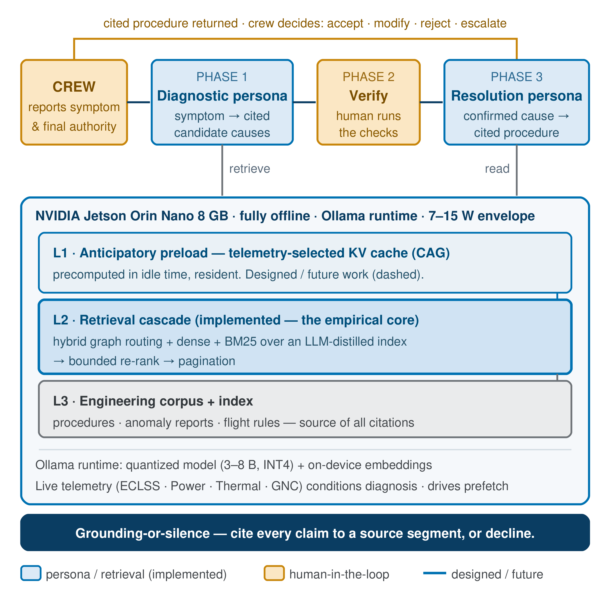

<div align="center">

# LODESTAR-FDX

**Fault diagnosis for a crew that can't call the ground.**

An offline, on-device diagnostic assistant: a 3B model over a knowledge graph of flight manuals, running inside 10 watts, returning ranked candidate causes each cited to a manual page — or declining.

[](https://github.com/ARC-lab-University-of-Washington/lodestar-fdx/actions/workflows/verify.yml)
[](docs/AI_USE.md#what-the-harness-verifies)
[](docs/AI_USE.md#what-the-harness-verifies)
[](requirements.txt)

[](LICENSE)
[](https://github.com/ARC-lab-University-of-Washington/apollo-anomaly-atlas)
[](https://doi.org/10.5281/zenodo.22713950)
[](#citation)
[](docs/AI_USE.md)



</div>

---

## The problem

Diagnosing Apollo 13's oxygen tank failure took 8 exchanges with the ground over 13.5 minutes. On the far side of the Moon, or on the way to Mars, that loop doesn't exist. The crew meets the cascade alone.

LODESTAR narrows the search. It does not make the decision.

## How it works

```
utterance ──▶ extract ──▶ BM25 seed ──▶ graph walk ──▶ scope gate ──▶ LLM ──▶ ranked causes
              (CPU)       (CPU)         (CPU)          (CPU)           (3B)    + citations
```

Everything before the model is **deterministic and CPU-only** — the same input gives the same chains every time, which is what lets a crew verify the output instead of trusting it. The model sees one chain at a time, in isolation. That is the hallucination control, and it lives in the calling code, not the prompt.

The **scope gate** runs before any answer is shown. If the symptom falls outside what the manuals cover, the system declines rather than guessing.

## Install

```bash
git clone https://github.com/ARC-lab-University-of-Washington/lodestar-fdx
cd lodestar-fdx
pip install -r requirements.txt        # rank_bm25, requests. That's it.
```

No torch. No embedding model. BM25-only retrieval, by design — the aerospace lexicon is entity-rich, sparse matching beats dense on it, and BM25 is auditable in a way a dense index is not.

Generation runs on a local [Ollama](https://ollama.com) server:

```bash
ollama pull llama3.2:3b
```

## Get the data

The corpus and the benchmark live in their own repository, so there is exactly one copy of each:

```bash
./scripts/get_atlas.sh
export LODESTAR_CORPUS=../apollo-anomaly-atlas/corpus/corpus.json
export LODESTAR_ATLAS=../apollo-anomaly-atlas/data/atlas_parsed.json
```

📦 **[apollo-anomaly-atlas](https://github.com/ARC-lab-University-of-Washington/apollo-anomaly-atlas)** — 3,370 corpus segments from 22 Apollo 13 operational documents, and 255 documented in-flight anomalies across the 11 crewed missions.

## Run it

```bash
python -m lodestar_edge.cli --corpus "$LODESTAR_CORPUS" \
  --symptom "Okay Houston, we've had a problem here. Main B bus undervolt."
```

Or read the symptom from stdin, and add `--multiturn` to keep a session open:

```bash
echo "MAIN B BUS UNDERVOLT, O2 quantity 2 reading zero" \
  | python -m lodestar_edge.cli --corpus "$LODESTAR_CORPUS"
```

Returns up to seven ranked candidate causes, each traceable through its chain to a manual page, plus a coverage score — or `DECLINE` if the symptom is out of scope.

## Reproduce the paper

```bash
cd eval
LODESTAR_CORPUS=$LODESTAR_CORPUS ./run_all.sh
```

| Metric | Value | Set |
|---|---:|---|
| Fault-direction accuracy @7 | 85% | 107 in-corpus crew-observed anomalies |
| Coverage AUC | 0.73 | 146 crew-observed anomalies |
| Median time to diagnosis | ~18 s | Jetson; hardware-dependent, see `docs/REPRODUCING.md` |
| Mean / peak power | 7.1 W / 10.6 W | measured on the Jetson — requires `tegrastats`, see `docs/MODEL.md` |

Accuracy, coverage and turn counts are hardware-independent. **Latency and power are not** — they are properties of the device.

What reproduces from the shipped artifacts, what needs a Jetson, and the known gaps: [`docs/REPRODUCING.md`](docs/REPRODUCING.md).

## Layout

```
lodestar_edge/     the deployable library — 7 modules, stdlib + rank_bm25 + requests
  segment.py         corpus loading
  retriever.py       salience-weighted BM25
  graph.py           links_to traversal, chain assembly
  scope_gate.py      out-of-domain detection, runs before generation
  diagnose.py        chain → candidate causes, cite-or-decline
  cli.py             command line entry point
eval/              the harness behind the reported numbers
  run_flagship.py  run_grounding.py  run_stackup.py  bench_latency.py
  data/            episode and scenario fixtures (not the atlas)
analysis/          26 scripts — ablations, scoring, coverage analysis
  subsystem_match.py   defines the in-corpus split
  score_subsystem.py   subsystem scoring
ingest/            how the corpus was built from the source PDFs
                   (needs requirements-ingest.txt — not required to run or evaluate)
scripts/           get_atlas.sh · verify_release.py
  pdf_ingest.py  run_ingestion.py  distill.py  corpus_clean.py  schema.py
docs/              MODEL.md · AI_USE.md · REPRODUCING.md · img/
```

`ingest/pdf_ingest.py` resolves Tesseract from `TESSERACT_CMD`, falling back to `shutil.which`. Set it if your install isn't on `PATH`.

## Verification

Every claim this repository makes about itself is checked by running it:

```bash
LODESTAR_CORPUS=../apollo-anomaly-atlas/corpus/corpus.json \
LODESTAR_ATLAS=../apollo-anomaly-atlas/data/anomalies.csv \
  python scripts/verify_release.py
```

Fourteen checks — the package imports cold, the corpus loads at 3,370 segments, the
boilerplate filter lands on 3,148/222, retrieval returns cited hits traceable to a
source document, the scope gate declines out-of-domain equipment without ever
declining a vehicle-system fault, and the 255 / 146 / 107 / 39 benchmark split
**recomputes from the shipped scorer** rather than being read from a stored column.
It asserts the paper's **85%** re-scores from the shipped run dump, and fails the
build on any `torch` import, so the BM25-only claim is enforced rather than described.

Runs in CI on every push against a fresh checkout of the benchmark repository.
Methodology, including the independent cross-model audit:
[`docs/AI_USE.md`](docs/AI_USE.md).

## Status

Research code accompanying a published paper. It is **not flight software** and has been through no flight qualification process of any kind. Do not fly it.

## Citation

```bibtex
@inproceedings{nathan2026sensemaking,
  title     = {Sensemaking Without Mission Control: How a Grounded Onboard Assistant
               Redistributes the Cognitive Work of Fault Diagnosis},
  author    = {Nathan, Gokul and Pasupathi, Kavimitiran and Shen, Yile and
               Stafford, Maxwell and Shao, Kevin and Mamishev, Alexander and Makhsous, Sep},
  booktitle = {SpaceCHI 2026}, year = {2026}, publisher = {Springer},
}
```

Using the benchmark? Cite the dataset too: [10.5281/zenodo.22713950](https://doi.org/10.5281/zenodo.22713950)

## License

BSD 3-Clause — see [LICENSE](LICENSE). Built with Llama; see [NOTICE](NOTICE) for the obligations that carry with that dependency. No model weights are distributed here.

<div align="center">
<sub>ARC Lab · University of Washington</sub>
</div>
